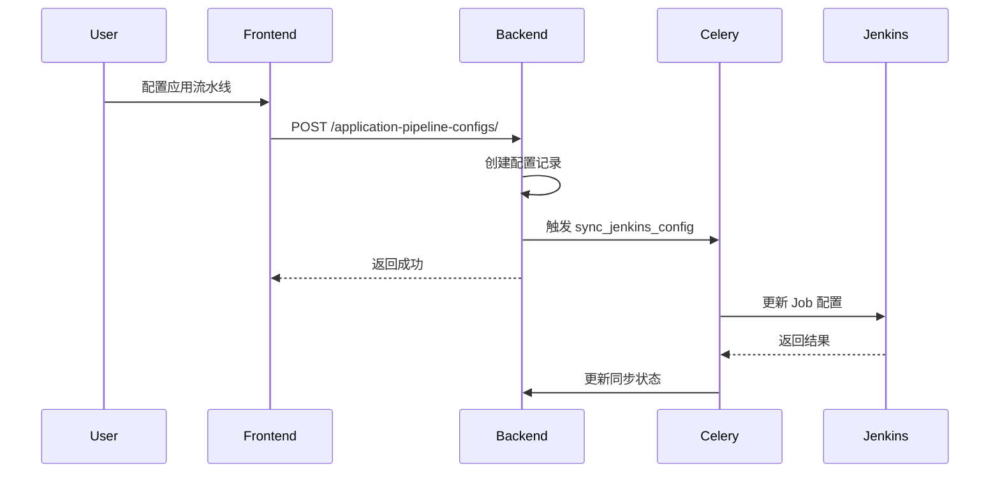

## 产品概述

CI/CD 模板系统用于统一管理 Jenkins 流水线配置文件（Jenkinsfile），支持版本化管理，应用可关联 CI/CD 模板配置，并与 Jenkins 保持同步。

## 核心功能

- **模板管理**：创建、编辑 CI/CD 模板，支持多版本管理，存储 Jenkinsfile 内容
- **应用配置**：应用关联 CI/CD 模板，配置变量参数，生成最终 Jenkinsfile
- **Jenkins 同步**：配置变更后自动同步到 Jenkins，保持一致性
- **版本追踪**：配置版本历史，支持回滚

## 技术栈

- **后端**: Django 5.2 + Django REST Framework + Celery
- **前端**: Vue3 + Vben-Admin + Ant Design Vue
- **数据库**: MySQL
- **缓存/队列**: Redis

## 已完成功能

1. **模型层**: PipelineTemplate、PipelineTemplateVersion、ApplicationPipelineConfig、ApplicationPipelineVersion
2. **视图层**: 模板管理 API（CRUD + 版本管理）、应用配置 API（生成 Jenkinsfile、回滚）
3. **前端**: 模板管理页面（列表、表单、版本管理）、应用管理页面
4. **服务层**: JenkinsService（创建 Folder、Job、CI/CD Jobs）
5. **异步任务**: 创建 GitLab、Jenkins、Harbor 资源

## 待完善功能

### 1. Jenkins 同步机制

- 新增 `sync_jenkins_config` 异步任务
- ApplicationPipelineConfig 变更后自动触发同步
- 更新 Jenkins Job 配置（Jenkinsfile 内容）

### 2. 应用配置界面优化

- 新增"流水线配置"Tab 页
- 关联 CI/CD 模板，配置变量
- 生成 Jenkinsfile 预览
- 同步状态展示

### 3. 同步状态追踪

- ApplicationPipelineConfig 增加 `jenkins_sync_status`、`jenkins_sync_time` 字段
- 记录同步日志到 SyncLog

## 实现方案

### 后端修改

```
backend/release/
├── models.py              # [MODIFY] ApplicationPipelineConfig 增加同步状态字段
├── serializers.py         # [MODIFY] 增加配置序列化器
├── views/
│   └── application_pipeline.py  # [MODIFY] 增加 sync_to_jenkins action
├── tasks.py               # [MODIFY] 增加 sync_jenkins_config 任务
└── services/
    └── jenkins_service.py # [MODIFY] 增加 update_job_config 方法
```

### 前端修改

```
web/apps/web-antd/src/
├── api/release/
│   └── applicationPipeline.ts  # [MODIFY] 增加同步 API
└── views/release/application/
    ├── index.vue               # [MODIFY] 增加"配置"操作按钮
    └── modules/
        └── pipelineConfig.vue  # [NEW] 流水线配置弹窗组件
```

## 架构设计

