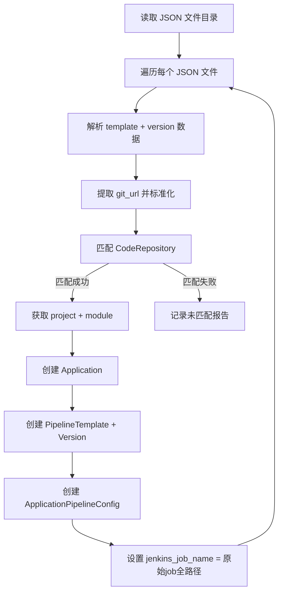

## 产品概述

将现有 Jenkins 环境中的 job 和流水线导入到 Bigdata-DevOps 系统，自动建立应用与项目/模块/代码仓库的关联关系，并确保导入后同步操作不改变已有 Jenkins job 的名称和路径。用户已有独立 Python 脚本（`docs/jenkinsjob-json.py`）完成 Jenkins API 对接、config.xml 解析、pipeline 脚本和 git_url 提取，并导出为 JSON 文件。系统侧的核心任务是接收导出的 JSON 文件，完成数据库关联创建和同步逻辑修改。

## 核心功能

- 读取用户脚本导出的 JSON 文件目录，逐个解析 job 数据
- 通过 JSON 中的 git_url 反查系统中已有的 CodeRepository（匹配 git_http_url 或 git_url 字段），自动获取关联的 project 和 module
- 创建 Application（应用名 = job_name）、PipelineTemplate + PipelineTemplateVersion（流水线模板及版本）、ApplicationPipelineConfig（关联测试环境）
- 导入后 `jenkins_job_name` 保存原始 job 全路径，同步状态标记为"已同步"，config_dirty=False
- 修改同步逻辑：已导入旧 job 保持原始 jenkins_job_name 路径同步，新建 job 才使用系统命名规则
- 支持 --dry-run 预检匹配结果和 --dir 指定 JSON 目录参数
- 扩展 Application.code 字段长度（32→128）以容纳长 job name

## 技术栈

- 后端框架: Django 5.2 + DRF（已有项目技术栈）
- 脚本入口: Django Management Command（遵循项目已有 `system/management/commands/` 模式）
- 数据库: MySQL（django_vue）
- 数据来源: 用户已导出的 JSON 文件（无需调用 Jenkins API）

## 实现方案

### 核心策略：git_url 自动匹配

用户脚本已将每个 job 导出为 JSON 文件，结构为 `{template:{name, code, language, language_version, framework, description, git_url}, version:{version, content, variables, stages, stages_content}}`。导入脚本读取 JSON 中的 `git_url` 字段，进行标准化（去 .git 后缀、统一路径），与 `CodeRepository.git_http_url` / `CodeRepository.git_url` 模糊匹配。匹配成功后从 CodeRepository 获取 project 和 module，建立 Application 关联。匹配失败则记录到未匹配报告，不创建该条数据。

### 同步逻辑修改

当前 `sync_jenkins_config`（tasks.py:522）和 `_sync_pipeline_config`（tasks.py:593）总是用系统命名规则构建 folder/name：

```python
folder = f"{app.project.code}/{module_code}/{app.code}"  # 系统命名规则
name = config.environment
```

修改为：如果 `config.jenkins_job_name` 已存在（已导入旧 job），直接 split('/') 解析为 folder 和 name，用原始路径同步。这与 `trigger_jenkins_build`（tasks.py:766-768）中已有的 `jenkins_job_name.split('/')` 解析逻辑完全一致。

### 关键技术决策

- **为何复用用户脚本而非重新实现 Jenkins API 对接**: 用户脚本已完成 Jenkins job 列表获取、config.xml 解析、git_url 标准化等复杂工作，系统侧只需处理 JSON 导入和数据库关联，避免重复开发
- **为何修改同步逻辑而非仅靠导入脚本**: 现有 `sync_jenkins_config` 总是用系统命名规则重建 folder/name（如 `project-a/module-b/app-c/test`），会覆盖导入的原始 job 路径（如扁平的 `my-old-job`），导致同步时在 Jenkins 上创建新 job 而非更新已有 job
- **为何扩展 Application.code max_length**: 当前 code max_length=32，Jenkins job name 可能超过 32 字符（如 `expert-platform-for-project-management`），需扩展到 128

## 实现说明

- 导入脚本创建数据时设置 `jenkins_sync_status=2`（已同步）、`config_dirty=False`，避免导入后立即触发同步覆盖原始 job
- git_url 匹配策略：先精确匹配 `git_http_url`，再精确匹配 `git_url`，最后尝试去除 .git 后缀模糊匹配
- 脚本支持 `--dry-run` 参数：仅输出匹配结果报告，不写入数据库
- 脚本支持 `--dir` 参数指定 JSON 文件目录（默认 `./jenkins_jobs_export`）
- 脚本支持 `--environment` 参数指定关联环境（默认 `test`）
- `PipelineTemplate.code` 需确保唯一性，使用 job_name 作为 code，若已存在则跳过并提示
- `Application` 创建时从 CodeRepository 同步 `git_url` 和 `gitlab_project_id`（遵循 `ApplicationCreateSerializer.create` 中已有逻辑）

## 架构设计



## 目录结构

```
backend/release/
├── management/                                # [NEW] management 命令目录
│   ├── __init__.py                            # [NEW] Python 包标识，空文件
│   └── commands/
│       ├── __init__.py                        # [NEW] Python 包标识，空文件
│       └── import_jenkins_jobs.py             # [NEW] 导入脚本核心。读取用户脚本导出的 JSON 文件目录，解析每个 job 的 template+version 数据，通过 git_url 匹配 CodeRepository 获取 project/module，创建 Application(name=job_name, code=job_name) + PipelineTemplate + PipelineTemplateVersion + ApplicationPipelineConfig(environment=test, jenkins_job_name=原始全路径, jenkins_sync_status=2)。支持 --dry-run 预检和 --dir/--environment 参数。
├── tasks.py                                   # [MODIFY] 修改 sync_jenkins_config(522行) 和 _sync_pipeline_config(593行)：增加 jenkins_job_name 已存在判断分支，已有则 split('/') 解析原始路径同步，否则用系统命名规则。_sync_pipeline_config 调用处(497行) folder 参数也需相应调整。
├── models.py                                  # [MODIFY] Application.code max_length 32→128，适配长 job name
└── migrations/
    └── 0023_alter_application_code_length.py  # [NEW] Application.code 字段长度变更迁移，使用 makemigrations 自动生成
```

## 关键代码结构

```python
# tasks.py 同步逻辑修改核心判断
def sync_jenkins_config(self, config_id):
    # ...获取 config 和 app...
    
    if config.jenkins_job_name:
        # 已导入旧 job：按原始路径同步
        parts = config.jenkins_job_name.split('/')
        job_name = parts[-1]
        folder = '/'.join(parts[:-1]) if len(parts) > 1 else None
    else:
        # 新建 job：用系统命名规则
        module_code = app.module.code if app.module else app.code
        folder = f"{app.project.code}/{module_code}/{app.code}"
        job_name = config.environment
    
    success = jenkins.update_job_config(
        name=job_name, folder=folder,
        jenkinsfile_content=content, ...
    )
```

## Agent Extensions

### SubAgent

- **code-explorer**
- Purpose: 在实现阶段深入探索 tasks.py 中 sync_application_jenkins 的完整调用链和 _sync_pipeline_config 的 folder 参数传递逻辑，确保同步逻辑修改不遗漏调用方
- Expected outcome: 确认所有调用 _sync_pipeline_config 的位置和 folder 参数来源，保证修改后调用方传参正确