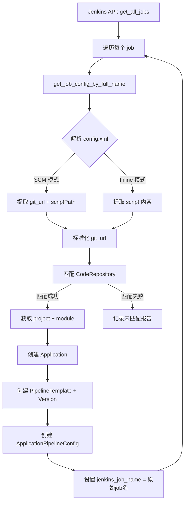

## 产品概述

将现有 Jenkins 环境中的 job 和流水线导入到 Bigdata-DevOps 系统，自动建立应用与项目/模块/代码仓库的关联关系，并确保导入后同步操作不改变已有 Jenkins job 的名称和路径。

## 核心功能

- 从 Jenkins 获取所有扁平结构 job 列表（通过 Jenkins View 分组展示）
- 解析每个 job 的 config.xml，提取 pipeline 定义（SCM 模式或 Inline Script 模式）
- 从 pipeline 定义中提取 git_url，通过 git_url 反查系统中已有的 CodeRepository，自动匹配项目、模块关系
- 创建 Application（应用名 = job_name）、PipelineTemplate + PipelineTemplateVersion（流水线模板）、ApplicationPipelineConfig（关联测试环境）
- 导入后 `jenkins_job_name` 保存原始 job 路径，同步状态标记为"已同步"
- 修改同步逻辑：已导入旧 job 保持原始路径同步，新建 job 才使用系统命名规则

## 技术栈

- 后端: Django 5.2 + DRF + python-jenkins / requests（已有 JenkinsService）
- 数据库: MySQL（django_vue）
- 脚本入口: Django Management Command
- XML 解析: xml.etree.ElementTree（Jenkins config.xml 解析）

## 实现方案

### 核心策略：git_url 自动匹配

1. 获取 Jenkins job 的 config.xml，解析出 `<url>` 标签（SCM 模式）或从 inline script 中正则提取 git 地址
2. 对提取的 git_url 进行标准化（去除 .git 后缀、统一协议），与 `CodeRepository.git_http_url` / `CodeRepository.git_url` 模糊匹配
3. 匹配成功 → 从 CodeRepository 获取 project、module，建立 Application 关联
4. 匹配失败 → 记录为"未匹配"并输出报告，支持后续手动补关联

### 关键技术决策

- **为何用 git_url 匹配而非手工映射**: 项目/模块/代码仓库已同步到系统，CodeRepository 中有 git_http_url 字段，Jenkins job config.xml 中也有 git url，可自动建立关联，大幅减少人工操作
- **为何在 config.xml 中同时处理 SCM 和 Inline 两种模式**: 用户确认两种模式都有，需在解析 config.xml 时根据 `<definition class="...">` 判断模式
- **为何修改同步逻辑而非仅靠导入脚本**: 现有 `sync_jenkins_config` 总是用系统命名规则重建 folder/name，会覆盖导入的原始 job 路径，必须区分"已导入旧 job"和"新建 job"
- **Application.name max_length=64 / code max_length=32**: Jenkins job name 可能超过 32 字符，需扩展 code 字段长度

### 同步逻辑修改细节

在 `sync_jenkins_config` 和 `_sync_pipeline_config` 中增加判断：

- 如果 `config.jenkins_job_name` 已存在（旧 job 导入），直接 split('/') 解析 folder 和 name，用原始路径同步
- 如果 `config.jenkins_job_name` 为空（新建），继续用系统命名规则 `f"{project.code}/{module_code}/{app.code}"` + env_code

这与 `trigger_jenkins_build` 中已有的 `jenkins_job_name.split('/')` 解析逻辑一致，保持统一。

### 性能考虑

- Jenkins API 逐个获取 config.xml 是 IO 密集操作，批量导入时使用单线程顺序请求避免 Jenkins 限流
- 脚本支持 `--dry-run` 参数预检匹配结果，不写入数据库
- 脚本支持 `--job-filter` 参数指定 job 名称前缀过滤，避免一次导入过多

## 实现说明

- JenkinsService 新增 `get_all_jobs()` 调用 Jenkins `/api/json?tree=jobs[name,url,color]` 获取根级 job 列表
- JenkinsService 新增 `get_job_config_by_full_name(full_name)` 支持用完整 job_name 获取 config.xml（扁平 job 无需 folder 参数）
- config.xml 解析逻辑：SCM 模式从 `<scm><userRemoteConfigs><hudson.plugins.git.UserRemoteConfig><url>` 提取 git_url 和 Jenkinsfile path；Inline 模式从 `<definition><script>` 提取 pipeline 脚本内容
- 导入脚本创建数据时设置 `jenkins_sync_status=2`（已同步）、`config_dirty=False`，避免导入后立即触发同步
- 扩展 `Application.code` max_length 从 32 到 128，需生成 Django migration

## 架构设计



## 目录结构

```
backend/release/
├── management/                           # [NEW] management 命令目录
│   ├── __init__.py                       # [NEW] Python 包标识
│   └── commands/
│       ├── __init__.py                   # [NEW] Python 包标识
│       └── import_jenkins_jobs.py        # [NEW] 导入脚本核心。实现 Jenkins job 批量导入逻辑：获取 job 列表 → 解析 config.xml → 提取 git_url → 匹配 CodeRepository → 创建 Application/PipelineTemplate/PipelineTemplateVersion/ApplicationPipelineConfig。支持 --dry-run 预检和 --job-filter 过滤参数。
├── services/
│   └── jenkins_service.py                # [MODIFY] 新增 get_all_jobs() 和 get_job_config_by_full_name() 方法。get_all_jobs 调用 /api/json?tree=jobs[name,url,color] 获取所有扁平 job；get_job_config_by_full_name 支持无 folder 的 config.xml 获取。
├── tasks.py                              # [MODIFY] 修改 sync_jenkins_config(522行) 和 _sync_pipeline_config(593行)：增加 jenkins_job_name 已存在判断，已有则用原始路径同步，否则用系统命名规则。
├── models.py                             # [MODIFY] Application.code max_length 32→128，适配长 job name
└── migrations/
    └── 0023_alter_application_code_length.py  # [NEW] Application.code 字段长度变更迁移
```

## 关键代码结构

```python
# config.xml 解析核心逻辑示意
def parse_jenkins_config(xml_str: str) -> dict:
    """解析 Jenkins job config.xml，提取 pipeline 类型和内容"""
    root = ElementTree.fromstring(xml_str)
    definition = root.find('.//definition')
    
    result = {'mode': None, 'git_url': None, 'script': None, 'script_path': None}
    
    if definition is not None:
        class_attr = definition.get('class', '')
        if 'CpsScmFlowDefinition' in class_attr:
            # SCM 模式: 从 <scm> 提取 git_url，从 <scriptPath> 提取路径
            result['mode'] = 'scm'
            url_elem = definition.find('.//userRemoteConfig/url')
            result['git_url'] = url_elem.text if url_elem is not None else None
            script_path = definition.find('scriptPath')
            result['script_path'] = script_path.text if script_path is not None else 'Jenkinsfile'
        elif 'CpsFlowDefinition' in class_attr:
            # Inline 模式: 从 <script> 提取内容，正则提取 git url
            result['mode'] = 'inline'
            script_elem = definition.find('script')
            result['script'] = script_elem.text if script_elem is not None else ''
            # 正则提取 git url
            git_match = re.search(r'(https?://[^\s]+\.git|git@[^\s]+)', result['script'])
            result['git_url'] = git_match.group(1) if git_match else None
    return result
```

## Agent Extensions

### SubAgent

- **code-explorer**
- Purpose: 在实现阶段深入探索 jenkins_service.py 中所有 job 操作方法的完整实现细节，确保新增方法与现有模式一致
- Expected outcome: 确认 _request、_build_job_path、job_exists 等方法的完整签名和用法，保证新增方法风格统一