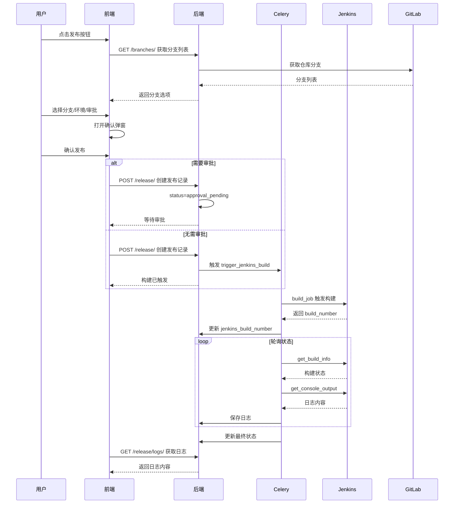

## 产品概述

在应用管理页面增加发布功能，支持选择分支、环境、审批流程后触发 Jenkins 构建，并记录发布日志用于审计。

## 核心功能

1. **发布按钮**：应用列表操作栏增加"发布"按钮
2. **发布弹窗**：选择分支、目标环境、是否需要审批、审批人
3. **发布确认框**：展示发布信息摘要，确认后触发构建
4. **发布记录**：记录每次发布操作的完整信息，支持审计查询
5. **构建日志**：从 Jenkins 拉取构建日志并存储到本地系统
6. **审批流程**：支持配置审批规则，审批通过后才触发构建

## 技术栈

- **后端**: Django 5.2 + Django REST Framework + Celery
- **前端**: Vue3 + Vben-Admin + Ant Design Vue
- **数据库**: MySQL
- **外部服务**: Jenkins API、GitLab API

## 实现方案

### 后端架构

1. **新增数据模型** (`backend/release/models.py`)

- `ReleaseRecord`: 发布记录（应用、分支、环境、审批、Jenkins 信息、状态）
- `ReleaseBuildLog`: 构建日志（关联发布记录、日志内容）
- `ApprovalRule`: 审批规则（环境、规则类型、审批人列表）

2. **新增视图** (`backend/release/views/release.py`)

- `ReleaseRecordViewSet`: 发布记录 CRUD
- `trigger_release`: 触发发布 API
- `approve_release/reject_release`: 审批操作
- `get_build_logs`: 获取构建日志

3. **新增异步任务** (`backend/release/tasks.py`)

- `trigger_jenkins_build`: 触发 Jenkins 构建
- `poll_build_status`: 轮询构建状态
- `fetch_build_log`: 拉取构建日志

4. **扩展 JenkinsService** (`backend/release/services/jenkins_service.py`)

- `build_job`: 触发 Job 构建
- `get_build_info`: 获取构建信息
- `get_build_console_output`: 获取控制台输出
- `stop_build`: 停止构建

### 前端架构

1. **新增组件** (`web/apps/web-antd/src/views/release/application/modules/`)

- `ReleaseModal.vue`: 发布配置弹窗（分支、环境、审批选择）
- `ReleaseConfirmModal.vue`: 发布确认弹窗
- `ReleaseLogModal.vue`: 构建日志弹窗

2. **新增 API** (`web/apps/web-antd/src/api/release/`)

- `deployment.ts`: 发布相关 API 接口

3. **修改现有页面**

- `index.vue`: 操作栏增加"发布"按钮
- `data.ts`: 增加发布相关操作

## 目录结构

```
backend/release/
├── models.py                    # [MODIFY] 新增 ReleaseRecord、ReleaseBuildLog、ApprovalRule
├── serializers.py               # [MODIFY] 新增发布相关序列化器
├── filters.py                   # [MODIFY] 新增 ReleaseRecordFilter
├── urls.py                      # [MODIFY] 新增发布相关路由
├── views/
│   └── release.py               # [NEW] 发布记录视图和 API
├── tasks.py                     # [MODIFY] 新增构建相关异步任务
└── services/
    └── jenkins_service.py       # [MODIFY] 新增构建触发和日志获取方法

web/apps/web-antd/src/
├── api/release/
│   └── deployment.ts            # [NEW] 发布相关 API
└── views/release/application/
    ├── index.vue                # [MODIFY] 增加发布按钮
    ├── data.ts                  # [MODIFY] 增加发布操作
    └── modules/
        ├── ReleaseModal.vue     # [NEW] 发布配置弹窗
        ├── ReleaseConfirmModal.vue  # [NEW] 发布确认弹窗
        └── ReleaseLogModal.vue  # [NEW] 构建日志弹窗
```

## 核心业务流程



## Agent Extensions

### SubAgent

- **code-explorer**
- Purpose: 在实现过程中探索复杂代码依赖关系
- Expected outcome: 确保代码实现与现有架构保持一致